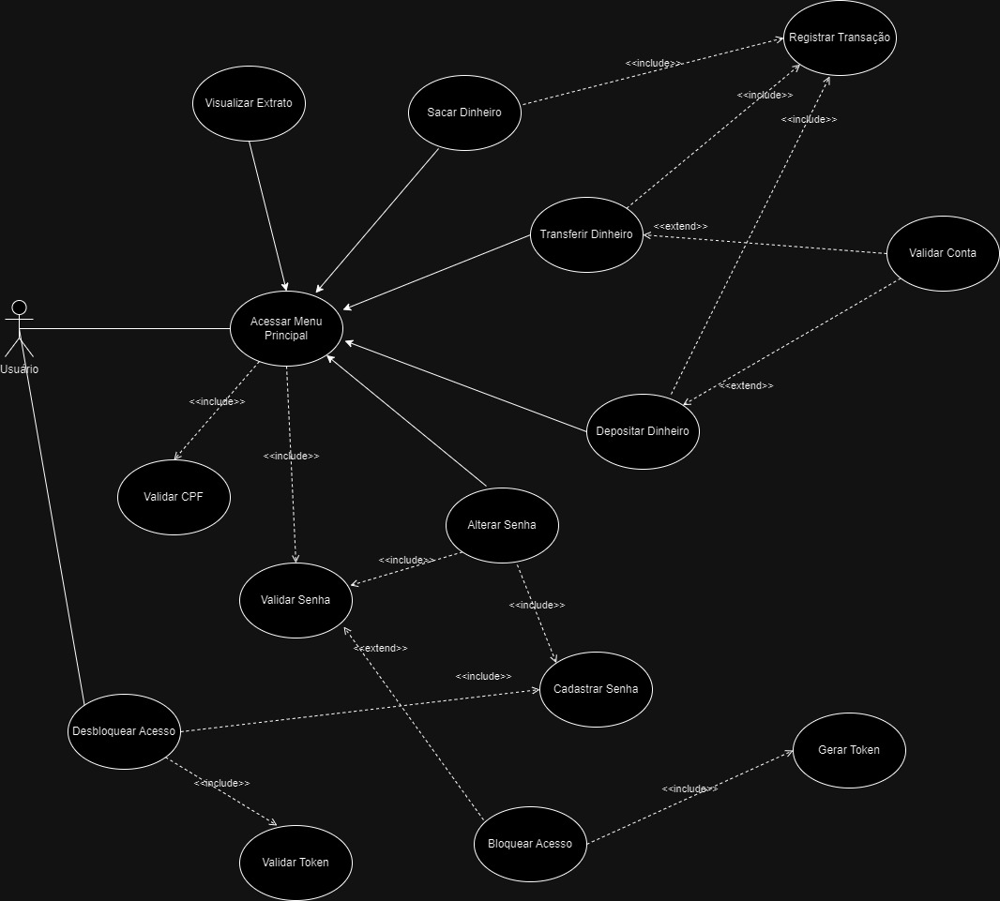

# ficticiobank-atm

## Descrição geral do projeto a ser desenvolvido

O projeto FicticioBank ATM é um simulador de caixa eletrônico simples, com interface gráfica, em Java. Ele permite que os usuários realizem operações bancárias básicas, como saque, depósito e transferência.

**Tecnologias**

O projeto é implementado na linguagem **Java** e com o gerenciador de dependências **Maven**.

A seguir, são descritas as bibliotea utilizadas.

**Dependências**
- **h2**: banco de dados relacional em memória leve e fácil de usar.
- **junit-jupiter-api**: para escrevermos testes JuNIT 5.
- **lombok**: para usarmos atotations e gerar automaticamente códigos Java comuns.

## Etapas do Desenvolvimento do Projeto:

### Elicitação dos requisitos

Nesta etapa foi redigido um documento que lista e especifica os requisitos da aplicação.

[Clique aqui](docs/requirements-elicitation/documento-elicitacao-requisitos.pdf) para acessar o documento.

A seguir, pode ser visto um resumo das funcionalidades da aplicação.
- **Extrato**: Visualização do extrato resumido das contas bancárias do usuário.
- **Depósito**: Realização de depósito em dinheiro ou cheque para qualquer conta bancária.
- **Saque**: Realização de saques de dinheiro de uma conta do usuário.
- **Transferência**: Transferência de dinheiro entre contas bancárias do mesmo titular ou do titular para terceiros.
- **Senha de acesso**: Alteração de senha de acesso ou desbloqueio pelo usuário.

### Modelagem de requisitos

Nessa fase, está sendo realizada a a abstração dos requisitos que foram levantados na fase de elicitação de requisitos para uma modelagem, com base na UML.

Para exemplificar as ações do sistema, usamos um diagrama de casos de uso, que vamos produzir na ferramenta [Draw.io](https://www.draw.io/).

[Arquivo diagrama-casos-uso.svg](docs/modelagem/diagrama-casos-uso.svg)

Abaixo pode ser visto a imagem do diagrama.

